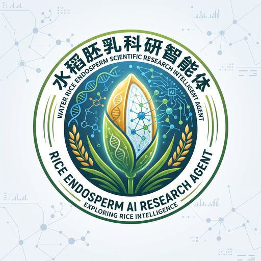

# 稻芯智析 Desktop



稻芯智析是面向水稻胚乳发育、灌浆调控、基因功能与组学分析的科研智能问答桌面客户端。客户端以 [Yuxi](https://github.com/xerrors/Yuxi) 作为 Agent 业务内核，通过 Yuxi API Key 连接用户指定的 APISIX/Yuxi 网关。

> 当前公开版是自托管客户端：首次启动时填写你的 Yuxi API Key 和网关地址。本地默认地址为 `http://127.0.0.1:9088`；远程网关必须使用 HTTPS。

## 下载与安装

前往 [GitHub Releases](https://github.com/yanmengli123/rice-endosperm-desktop/releases/latest) 下载 Windows 安装包：

- 推荐普通用户下载 `稻芯智析_*_x64-setup.exe`（NSIS）。
- 需要企业软件分发时下载 `.msi`。
- 应用内“设置与连接 → 检查更新”可安装后续签名更新。

首个公开版本尚未配置商业 Authenticode 证书，Windows SmartScreen 可能显示“未知发布者”。安装包仍由 GitHub Actions 从公开源码构建，并使用 Tauri 更新签名保证自动更新包的完整性。正式生产发行建议配置 OV/EV 代码签名证书。

## 核心能力

- assistant-ui 对话体验、Markdown/GFM 渲染和水稻胚乳科研品牌界面。
- Yuxi 异步 Agent run、SSE 增量输出、`Last-Event-ID` 断线续传和原任务结果恢复。
- 本地与服务端双重取消，不因网络重试创建重复 run。
- Stronghold 加密 vault + 操作系统凭据保险库保存 API Key；Key 不进入 SQLite、浏览器存储或日志。
- SQLite 保存本地会话、消息和运行恢复状态。
- Tauri 2 原生 Windows 安装包和 GitHub Releases 自动更新。
- 远程地址强制 HTTPS，本机开发地址例外；严格 CSP 和最小 Tauri capability。

## 使用前提

你的 Yuxi/APISIX 实例需要开放以下经过 API Key 认证的接口：

```text
GET  /api/agent-invocation/credential-status
POST /api/agent-invocation/agent-call/runs
POST /api/agent-invocation/agent-call/runs/result
GET  /api/agent/runs/{run_id}/events?verbose=false
POST /api/agent/runs/{run_id}/cancel
```

配套 Yuxi 改造位于 [rice-endosperm-agent](https://github.com/yanmengli123/rice-endosperm-agent)。

## 本地开发

环境要求：Node.js 22+、pnpm 10、Rust stable、Tauri 2 的 Windows 构建依赖和 WebView2。

```powershell
git clone https://github.com/yanmengli123/rice-endosperm-desktop.git
cd rice-endosperm-desktop
pnpm install --frozen-lockfile
. .\.github\scripts\prepare-libsodium.ps1
pnpm tauri dev
```

可通过编译期变量改变新安装用户看到的默认值：

```powershell
$env:YUXI_BASE_URL = "https://api.example.cn"
$env:YUXI_AGENT_SLUG = "default-chatbot"
pnpm tauri build --bundles nsis,msi
```

未配置变量时默认连接 `http://127.0.0.1:9088` 和 `default-chatbot`。变量只决定首次默认值，不包含任何 API Key。

## 质量检查

```powershell
pnpm check
cargo fmt --manifest-path src-tauri/Cargo.toml -- --check
cargo clippy --manifest-path src-tauri/Cargo.toml --all-targets -- -D warnings
cargo test --manifest-path src-tauri/Cargo.toml
```

Windows 首次编译 Stronghold 前请在当前 PowerShell 中点调用 `. .\.github\scripts\prepare-libsodium.ps1`。脚本会下载官方 libsodium 动态运行库、校验固定 SHA-256，并把 DLL 放入 Tauri 安装包资源；这种方式也避免静态 CRT 与 Rust MSVC 运行库冲突。

## 数据与安全

- 应用不内置、收集或代管用户的 Yuxi API Key。
- 对话请求只发往用户配置的网关；本项目不包含遥测或第三方分析 SDK。
- 删除本机 API Key 不会删除本地历史会话；卸载策略与完整数据位置见 [隐私说明](PRIVACY.md)。
- 发现漏洞请按 [安全政策](SECURITY.md) 私下报告，不要在公开 Issue 中提交密钥或漏洞细节。

## 版本发布

版本标签触发 GitHub Actions 构建并发布安装包：

```powershell
git tag v0.1.1
git push origin v0.1.1
```

发布所需更新签名私钥只保存在 GitHub Actions Secrets 中，仓库仅提交公钥。完整流程见 [发布指南](docs/RELEASING.md)。

## 许可证与声明

本项目使用 [MIT License](LICENSE)。Yuxi 是独立的开源项目；“稻芯智析”不是医疗、农艺或实验决策的替代品，重要科研结论应核对原始文献并通过实验验证。
